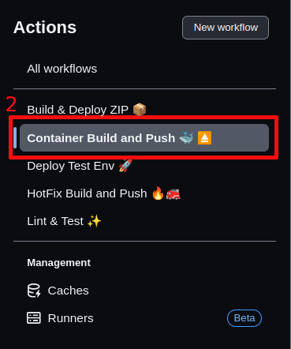
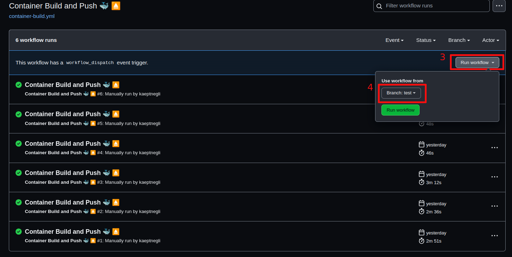
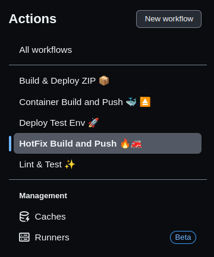
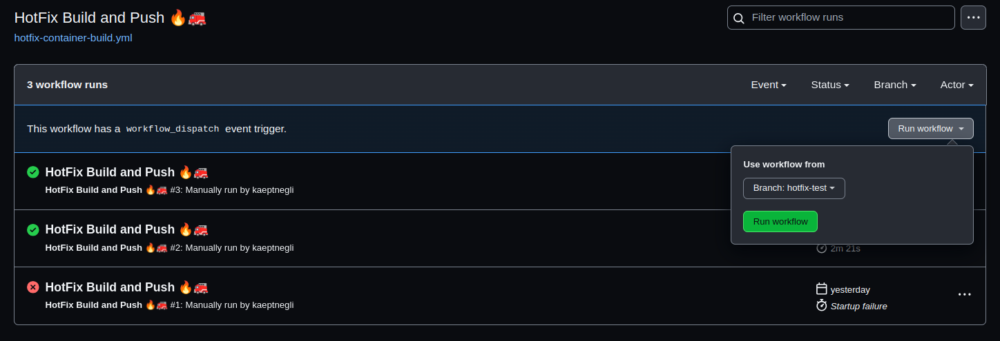
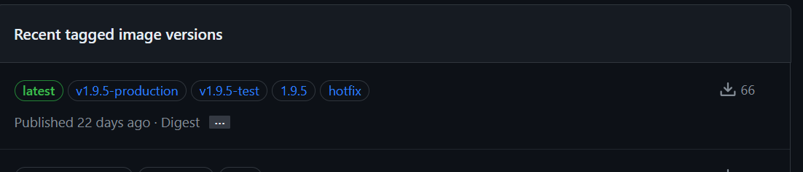

[back](../README.md)

# Branching, Releasing & Deployment

## Environments

Here is an overview of the operation environments the _Evento Portal_ will be deployed to and their corresponding Git branches:

| Environment | Platform           | Git Branch   | Purpose                                                  |
| ----------- | ------------------ | ------------ | -------------------------------------------------------- |
| Development | Netlify            | `main`       | Review latest changes during development                 |
| Test        | Bedag (Kubernetes) | `test`       | Test on close to production environment before releasing |
| Production  | Bedag (Kubernetes) | `production` | "Live" version used by the users                         |
| Hotfix      | Bedag (Kubernetes) | `hotfix-*`   | Deploying hotfixes to production                         |

## Branching & Releasing Concept

Development:

- The active development happens in the `main` branch using temporary feature branches that are merged back into `main`. The naming scheme for feature branches should be `feature/1234-short-description` (with `1234` being the issue number and `short-description` being summary of the purpose of the branch).

- Based on the [testBuildEnv.yml](../.github/workflows/testBuildEnv.yml) GitHub Actions workflow, the latest commit from the `main` branch will be deployed to a _development_ environment on Netlify (on push). This is used by BKD to review the latest changes during development. The deployment itself is not part of the workflow.

Test:

- To release & deploy to the _test_ environment running at Bedag, BKD merges the `main` branch into the `test` branch. The workflow [container-build.yml](../.github/workflows/container-build.yml) builds a Docker image (see [Dockerfile](../Dockerfile)) and pushes the image to the Docker registry (TODO: describe which one; what about registry sync?). This image will be tagged with the `test` tag and an automatically incremented version tag (e.g. `1.3.0`). The Git commit will also be tagged with this version tag (e.g. `v1.3.0`). In a Gitops manner, the Bedag cluster will then deploy the `test` Image to the _test_ environment.

Production:

- To release & deploy to the _production_ environment running at Bedag, BKD merges the `test` branch into the `production` branch. The workflow [container-build.yml](../.github/workflows/container-build.yml) can usually reuse the Docker image already built for this commit and will tag it with the `production` tag. In a Gitops manner, the Bedag cluster will then deploy the `production` Image to the _production_ environment.

Hotfix:

When a hotfix situation occurs, a new branch is created from the `production` branch. The namig scheme si quite similar to the one used for developement branches. hotfix/1234-short-description (with `1234` being the issue number and `short-description` being summary of the purpose of the branch). The hotfix is applied on to the newly created hotfix branch. When to changes are ready to deploy one can use the workflow [hotfix-container-build.yml](../.github/workflows/hotfix-container-build.yml), to build a new image. This image will be tagged with the `hotfix` tag and automatically incremented version tag. Note that the version for hotfixes will be incremented on the patch level. If you create a hotfix form 1.3.0, the first hotfix build will recieve the version 1.3.1. Once the changes are applyied to production and hotfic developement is over, the newly made changes can be cherry picked upon the `main` branch. Before the next `production` release, `test` needs to be released again. Otherwise the hotfic will not be applied with the next `production` release.

## Release Instructions

This chapter desciprtes how you can deploy newq releases with github actions. The first step is always the same:

1. In the top bar of the Github project select the tab `Actions`

### Standard Release Cycle (test/production)

2. On the left list select the Workflow `Container Build and Push 🐳 ⏏️`

3. Click on the `Run workflow` button, a tooltip will open. It containt a dropdown button, from which you can choose a branch.

4. Always choose the branch you want to deploy a new version from. If you want to merge `main` into `test` and release a new test iamge, choose `test`. If you want to deploy production, choose `production`

### Hotfix Release Cycle

2. On the left list select the Workflow `HotFix Build and Push 🔥🚒` 

3. Click on the `Run workflow` button, a tooltip will open. It containt a dropdown button, from which you can choose a branch.

4. Always choose the branch you want to deploy a new version from. Choose the hotfix branch you jusr created from `production`

5. In the end the package repository should look similar to that:

