[back](../README.md)

# Software Architecture Documentation (SAD)

**About arc42**

arc42, the template for documentation of software and system
architecture.

Template Version 8.2 EN. (based upon AsciiDoc version), January 2023

Created, maintained and © by Dr. Peter Hruschka, Dr. Gernot Starke and
contributors. See <https://arc42.org>.

# Introduction and Goals

This document describes the _Evento Portal_, an application that integrates various _apps_ (micro frontends) for school administration in a single web frontend with a common look and feel. The _Evento Portal_ and the integrated _apps_ use the "EVENTO" campus management system by Swiss Learning Hub as their backend.

Goals:

- The _Evento Portal_ and the integrated _apps_ should provide a flexible way to develop new tools in short cycles that can be integrated into the existing "EVENTO" system.
- The user interface should comply with the [CI/CD of the Canton of Bern](https://www.cd.sites.be.ch/d/mLaezX2xseW6/anwendungen#/web-mobile/web-applikationen).
- The _Evento Portal_ replaces the former "EventoWeb".

## Requirements Overview

| _Requirement_               | _Description_                                                                                                                                                                                                                                                                             |
| --------------------------- | ----------------------------------------------------------------------------------------------------------------------------------------------------------------------------------------------------------------------------------------------------------------------------------------- |
| Authentication/Login        | A user can authenticate via "EVENTO" using the [OAuth 2.0 Authorization Code Flow mit Proof Key for Code Exchange (PKCE)](https://clx-evento.bitbucket.io/master_eventodoc/Api/Autorisierung/Login-OAuth-Server/#authorization-code-flow-mit-proof-key-for-code-exchange-pkce).           |
| Logout                      | A user can logout.                                                                                                                                                                                                                                                                        |
| Token refresh               | Access tokens are automatically refreshed so they don't expire.                                                                                                                                                                                                                           |
| Token for _apps_            | The access token is made available in session storage to the _apps_.                                                                                                                                                                                                                      |
| Language switching          | A user can switch the language between German and French.                                                                                                                                                                                                                                 |
| Language/Tenant persistence | The selected tenant and language is remembered when logging in the next time with the same browser.                                                                                                                                                                                       |
| Base layout                 | Renders the base layout with header & footer according to the [CI/CD of the Canton of Bern](https://www.be.ch/cd).                                                                                                                                                                        |
| Navigation menu             | A navigation menu is rendered, providing entry points for _modules_ of the various _apps_. The navigation items are available depending on the user's roles and permissions. No dynamic configuration is necessary for the definition of the navigation items, structure and permissions. |
| _App_ integration           | The various _apps_, implemented with different frontend technologies (such as Angular or Ember) are integrated in a way they don't interfere with each other and are cleaned-up properly when switching apps.                                                                             |
| _App_ routing               | The _apps_' client-side routing is preserved.                                                                                                                                                                                                                                             |
| Teacher substitution        | Teachers can start & stop substituting other teachers, temporarily gaining the permissions of the substitute.                                                                                                                                                                             |
| User notifications          | A user's notifications are displayed (and regularly updated) and can be read/deleted by the user.                                                                                                                                                                                         |
| Progressive Web App (PWA)   | The _Evento Portal_ is installable as a PWA and offers a simple offline page when no internet connection is available.                                                                                                                                                                    |

## Quality Goals

| _Quality Category_ | _Quality_       | _Description_                                                                                                                                                                                                  |
| ------------------ | --------------- | -------------------------------------------------------------------------------------------------------------------------------------------------------------------------------------------------------------- |
| Usability          | Operability     | Ease-of-use by teachers, students and secretary staff, potentially on mobile devices during a course (responsiveness).                                                                                         |
| Usability          | Learnability    | Teachers, students, and secretary staff should be able to learn to use the application effectively.                                                                                                            |
| Usability          | Accessibility   | The application should be accessible in accordance with the [accessibility guidelines of the Canton of Bern](https://www.sta.be.ch/de/start/themen/kommunikation-und-aussenbeziehungen/barrierefreiheit.html). |
| Compatibility      | Co-existence    | Various _apps_ implemented with different frontend technologies must be integrated without interference.                                                                                                       |
| Security           | Confidentiality | The _Evento Portal_ should be basically stateless and not persist any user data (particularly data worthy of protection). This task is performed by the "EVENTO" system.                                       |

Quality categories & qualities according to [ISO/IEC 25010](https://iso25000.com/index.php/en/iso-25000-standards/iso-25010).

## Stakeholders

| _Role_                         | _Organisation/Company_                                                                                          | _Name_                                                                                          |
| ------------------------------ | --------------------------------------------------------------------------------------------------------------- | ----------------------------------------------------------------------------------------------- |
| Specialist Application Manager | [BKD-MBA-FBI](https://www.bkd.be.ch/de/start/ueber-uns/die-organisation/mittelschul-und-berufsbildungsamt.html) | [@fbufbi](https://github.com/fbufbi)                                                            |
| Technical Application Manager  | [BKD-MBA-FBI](https://www.bkd.be.ch/de/start/ueber-uns/die-organisation/mittelschul-und-berufsbildungsamt.html) | [@schefbi](https://github.com/schefbi)                                                          |
| Project Leader/SCRUM Master    | [Puzzle ITC](https://www.puzzle.ch)                                                                             | [@lmathys](https://github.com/lmathys)                                                          |
| Software Engineer & UX         | [Puzzle ITC](https://www.puzzle.ch)                                                                             | [@caebr](https://github.com/caebr)                                                              |
| Software Engineer & Architect  | [Puzzle ITC](https://www.puzzle.ch)                                                                             | [@hupf](https://github.com/hupf)                                                                |
| UX Engineer                    | [Puzzle ITC](https://www.puzzle.ch)                                                                             | [@shirsbrunner](https://github.com/shirsbrunner) & [@pmurkowsky](https://github.com/pmurkowsky) |
| Operations                     | [BEDAG](https://www.bedag.ch/)                                                                                  |                                                                                                 |
| Backend Engineering            | [Swiss Learning Hub](https://www.swisslearninghub.com/)                                                         |                                                                                                 |

# Architecture Constraints

The _Evento Portal_ shall be...

- ...compatible with evergreen browsers (Chrome, Firefox, Safari, Edge).
- ...published under an open source license.
- ...integrating third-party _apps_ without the possibility to do any modifications to the _app_'s source code.
- ...compliant with the "EVENTO" system's usage of OAuth scopes, where a different access token for a different scope must be used depending on the _app_.
- ...handling the inability to fetch access tokens asynchronously, therefore incorporate the necessary redirects (with page refresh) without interrupting the user.

# System Scope and Context

## Technical Context

```mermaid
graph LR
  student(("👩‍🎓
  Student"))
  teacher(("👩‍🏫
  Teacher"))
  secretary(("👨‍💼
  Secretary"))
  admins(("👷
  Administrator"))
  portal["Evento Portal
  Lit Application"]

  schulverwaltung["App 'Schulverwaltung'
  (Angular)"]
  kursausschreibung["App 'Kursausschreibung'
  (Ember)"]
  etc["More apps..."]

  subgraph evento ["EVENTO (SLH)"]
    evento-api[REST API]
    evento-oauth[OAuth Provider]
    evento-gui[Client Application]
  end

  student --> |uses| portal
  teacher --> |uses| portal
  secretary --> |uses| portal
  secretary --> |uses| evento-gui
  admins --> |uses| evento-gui

  subgraph portalsystem ["Evento Portal"]
    portal <--> |iframe/postMessage/sessionStorage| schulverwaltung
    portal <--> |iframe/postMessage/sessionStorage| kursausschreibung
    portal <--> |iframe/postMessage/sessionStorage| etc
  end

  schulverwaltung --> |HTTP/JSON| evento-api
  kursausschreibung --> |HTTP/JSON| evento-api
  etc --> |HTTP/JSON| evento-api

  portal --> |HTTP/JSON| evento-api
  portal <--> |OAuth 2.0| evento-oauth
```

| _Element_                     | _Description_                                                                                                                                                                                                                                                                                                                                                                                                                            |
| ----------------------------- | ---------------------------------------------------------------------------------------------------------------------------------------------------------------------------------------------------------------------------------------------------------------------------------------------------------------------------------------------------------------------------------------------------------------------------------------- |
| Student (User)                | Students of a baccalaureate school or vocational school, reporting and confirming absences, reviewing tests & grades etc.                                                                                                                                                                                                                                                                                                                |
| Teacher (User)                | Class or lesson teachers of a baccalaureate school or vocational school, managing student absences, tests & grades, booking courses etc.                                                                                                                                                                                                                                                                                                 |
| Secretary (User)              | Staff of a baccalaureate school or vocational school office, managing student absences etc.                                                                                                                                                                                                                                                                                                                                              |
| Administrator (User)          | People configuring EVENTO.                                                                                                                                                                                                                                                                                                                                                                                                               |
| Apps                          | Various mini applications – like [webapp-schulverwaltung](https://github.com/bkd-mba-fbi/webapp-schulverwaltung) (Angular) or [kursausschreibung](https://github.com/bkd-mba-fbi/kursausschreibung) (Ember) – that provide a frontend for different aspects of the daily school routine. They may consist of multiple _modules_ like "presence control" or "tests" that are individually integrated in the _Evento Portal_'s navigation. |
| Evento Portal Lit Application | The [evento-portal](https://github.com/bkd-mba-fbi/evento-portal/) is the Lit application that implements authentication, the rendering of the base layout with navigation, base routing as well as the integration of the _apps_ via iframe.                                                                                                                                                                                            |
| Evento Portal                 | The _Evento Portal_ as a whole consists of the _Evento Portal Lit Application_ on the one hand, and the compiled artifacts of the various _apps_, which [are part of the repository](https://github.com/bkd-mba-fbi/evento-portal/tree/feature/68-sad/public/apps), on the other.                                                                                                                                                        |
| EVENTO                        | The campus management system by [Swiss Learning Hub](https://www.swisslearninghub.com/) that incorporates a REST/JSON API and an OAuth 2.0 provider.                                                                                                                                                                                                                                                                                     |

### Technical Interfaces

- [EVENTO API](https://clx-evento.bitbucket.io/master_eventodoc/Api/)
- [EVENTO OAuth 2.0 Provider](https://clx-evento.bitbucket.io/master_eventodoc/Api/Autorisierung/Login-OAuth-Server/)
- [iframe Limitations & Workarounds](./iframe.md)

# Solution Strategy

- Implement _Evento Portal_ as a client-side rendered application with lightweight Lit/Web Components and minimal dependencies.
- Integrate the _apps_ with an iframe to ensure proper separation of runtime environments.

# Runtime View

## Authentication

If no valid access token for the given app/scope (see next section) and no valid refresh token is available, the authentication flow works as follows:

This flow is implemented with the help of the [@badgateway/oauth2-client](https://www.npmjs.com/package/@badgateway/oauth2-client) library in [auth.ts](../src/utils/auth.ts). The storing of the tokens is realized with [token-state.ts](../src/state/token-state.ts). See also the EVENTO documentation page [OAuth 2.0 Authorization Code Flow mit Proof Key for Code Exchange (PKCE)](https://clx-evento.bitbucket.io/master_eventodoc/Api/Autorisierung/Login-OAuth-Server/#authorization-code-flow-mit-proof-key-for-code-exchange-pkce).

## Switch Apps/Scopes

The access tokens are bound to a specific [OAuth scope](https://clx-evento.bitbucket.io/master_eventodoc/Api/Autorisierung/ApplicationScopes_Intro/) that is specified when getting a token via login page or refresh token endpoint. Each _app_ requires a certain scope since the scope determines what the user can access. Due to this design by the _Evento API_, it is not possible to acquire and work with a single token for multiple scopes.

The _Evento Portal_ handles tokens & scopes as follows:

```mermaid
sequenceDiagram
  actor user as User
  participant portal as Evento Portal
  participant app as App
  participant oauth as EVENTO OAuth Provider

  user ->> portal: Visit app with scope A

  activate portal
  portal ->> portal: Has valid access token for scope A in localStorage? → Yes
  portal ->> portal: Store access token for scope A in sessionStorage
  portal ->> app: Load app via iframe
  deactivate portal

  activate app
  app ->> app: Read access token from sessionStorage
  app -->> user: Render app contents
  deactivate app

  user ->> portal: Visit app with scope B

  activate portal
  portal ->> portal: Has valid access token for scope B in localStorage? → No
  portal ->> oauth: Redirect to /Authorization/RefreshPublic w/refresh token
  deactivate portal

  activate oauth
  oauth -->> portal: Redirect back with access token for scope B
  deactivate oauth

  activate portal
  portal ->> portal: Store tokens (per scope) in localStorage
  portal ->> portal: Store access token for scope B in sessionStorage
  portal ->> app: Load app via iframe
  deactivate portal

  activate app
  app ->> app: Read access token from sessionStorage
  app -->> user: Render app contents
  deactivate app
```

## Token Refreshing

Apparently, at the time writing this, the _Evento API_ does not provide any way to refresh tokens asynchronously. This means that the tokens can only be renewed with a redirect, interrupting the user. We therefore try to implement the following checks:

- Whenever the scope changes, i.e. the user clicked in the navigation:
  - If the refresh token _fully expired_, redirect to the login page (as described in the "Authentication" flow above).
  - If the access token _half expired_, redirect to the [refresh token endpoint](https://clx-evento.bitbucket.io/master_eventodoc/Api/Autorisierung/RefreshToken/#refresh-mit-public-client) to get a new one. Like this, we try to make sure that the token does not expire during usage of the _apps_.
- Start timers to detect when tokens expire:
  - If the refresh token expired (timer fires), redirect to the login page (as described in the "Authentication" flow above).
  - If the access token expired (time fires), redirect to the [refresh token endpoint](https://clx-evento.bitbucket.io/master_eventodoc/Api/Autorisierung/RefreshToken/#refresh-mit-public-client) to get a new one.

The checks on navigation are implemented in [auth.ts](../src/utils/auth.ts), the renewal on expiration is implemented in [token-renewal.ts](../src/utils/token-renewal.ts).

Here is an example flow of an access token renewal on navigation:

Here is an example flow of a refresh token renewal on expiry (using a timer):

## Substitution Start/Stop

The starting or stopping of a teacher substitution also happens via a redirect and results in a new token (without code verifier). The redirect is implemented in the [SubstitutionsToggle.ts](../src/components/Header/SubstitutionsToggle.ts) component, the handling of the result in [auth.ts](../src/utils/auth.ts).

# Deployment View

For more details, consider [Deployment](./deployment.md).

# Architecture Decisions

## ADR 1: Client-side Rendering with Lit & Web Components

### Context

The _Evento Portal_ replaces the _EventoWeb_ and should render a base layout, a statically configured navigation and integrate the various _apps_. It should also handle the OAuth 2.0 Authentication flow.

### Decision

- Due to the vague requirements of the targeted operations environment at the time of planning the project, we decided to implement the _Evento Portal_ as a Client-side rendered application.
- Since we have to integrate _apps_ based on different technologies (Angular, Ember), we choose to build a lightweight, framework-agnostic frontend with Lit and Web Components.

Alternatives:

- Server-side rendered web application (e.g. with Node.js or any other backend technology) with full page reloads on navigation.

### Consequences

- The static files we get as build artifacts can be served with any web server and are completely stateless.
- The OAuth 2.0 authentication flow has to be implemented client-side originating from an untrusted client. The refresh & access token must be available to the client and will be stored in the browser.
- Thanks to the shadow DOM Web Components feature any stylesheets on the page will not interfere with styles of components and vice versa.
- Since we have a single page application (SPA), the page will not be reloaded on navigation. Therefore, the JavaScript frameworks of the integrated _apps_ have to be bootstrapped/destroyed cleanly (see ADR 2).

## ADR 2: App Integration via iframe

### Context

The _apps_, implemented with different frameworks (Angular, Ember) have to be bootstrapped/destroyed cleanly when switching _apps_ and must not interfere with each other.

### Decision

- For the safest separation possible, we will integrate the _apps_ via iframe, which is a common approach in micro frontend architectures.

Alternatives:

- Removing DOM nodes via JavaScript, bootstrapping the new _app_. But what about dangling memory objects, timers/intervals, event handlers and subscriptions?

### Consequences

- The different _apps_/frameworks have a completely separated runtime environment that is properly cleaned-up, when leaving an _app_.
- [URL Synchronization](./iframe.md#url-synchronization)
- [iframe Resizing](./iframe.md#iframe-resizing)
- [Scrolling](./iframe.md#scrolling)
- [Positioning of Elements](./iframe.md#positioning-of-elements)
- Possibly more restrictions...

# Risks and Technical Debts

## Technical Risks

- Non-standard implementation of OAuth 2.0 by EVENTO.
- Restrictions due to integration of _apps_ via iframe.
